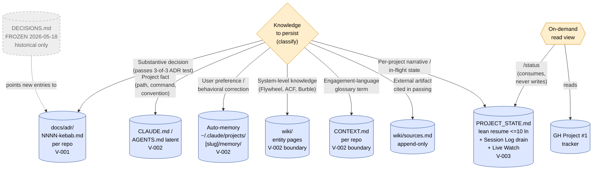
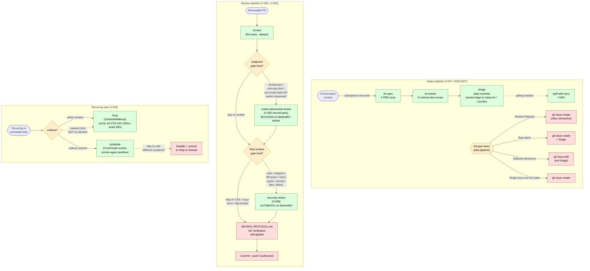
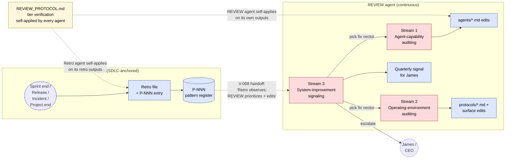

# Tool Landscape — Reconciliation

> **Status:** v1 complete (2026-05-20) — Sessions 1 + 2 + 3 landed; all 10 verdicts (V-001 → V-010) + 4 stretch artifacts (Matrix / Conflict log / Workflow guide / Diagram) filled.
> **Tracking:** [ai-agent-harness#8](https://github.com/itsginfo/ai-agent-harness/issues/8) · **Establishment ADR:** [`docs/adr/0001-tool-landscape-establishment.md`](docs/adr/0001-tool-landscape-establishment.md)
> **Authoritative for:** which tool to reach for, at what step, when more than one could do the job.
> **Audience:** agents and James, in both directions.

This document is the long-form reference. The 14-row **crib table** in [`CLAUDE.md` `## Tool reach-for rules`](CLAUDE.md) is the boot-time signal; reasoning lives here.

---

## Reading orientation

- **Need a fast pick at decision time?** Use the crib in `CLAUDE.md`.
- **Need the reasoning behind a pick?** Find the `V-NNN` in this doc; its supporting ADR is in `docs/adr/`.
- **Need to know whether two tools conflict at all?** Check the matrix; entries marked **boundary** mean the tools do different jobs that look adjacent, not the same job.
- **Picking a tool for a scenario not covered here?** That's a gap — open an issue and propose the verdict.

---

## Tool layers in scope

1. **Matt Pocock engineering skills** — `/triage`, `/to-tickets`, `/to-spec`, `/qa`, `/improve-codebase-architecture`, `/diagnose`, `/tdd`, `/grill-with-docs`, `/grill-me`, `/simplify`, `/fewer-permission-prompts`, `/security-review`, `/review`. Installed per-repo via `/setup-matt-pocock-skills`.
2. **Agent harness** — agent role definitions (`agents/`), protocols (`protocols/`), `PROJECT_STATE.md`, per-project `DECISIONS.md`, retrospectives, GH Issues + GH Project #1 tracker layer.
3. **Wiki** — `projects/<name>/wiki/` and harness-root `wiki/`. Entity pages for stable system knowledge.
4. **OpenAI Codex plugin + CLI** — `/codex:review`, `/codex:adversarial-review`, `/codex:rescue`. Hard MethodRX/HIPAA exclusion (no BAA, CTO standing rule 2026-04-30).
5. **Task subagents** — `Explore`, `Plan`, `general-purpose`, `claude-code-guide`. Built into Claude Code; not installed per-project.
6. **Routines + scheduling** — claude.ai scheduled remote agents, `/loop` (intra-session interval), `/schedule` (cron-style routines).

---

## Verdict template

Each `V-NNN` follows this structure:

```
### V-NNN — <job description>

**Winner:** <tool>
**Deprecated / loser:** <tool> (since YYYY-MM-DD; doc-only) — or "N/A (boundary)" / "N/A (sequencing)"
**Job category:** <category from matrix>
**Use when:** <trigger phrases — what the human says, or what the situation looks like>
**Reasoning:** <why this winner; what makes the loser a worse fit>
**Sequencing:** <if part of a chain, name the upstream/downstream tools>
**Edge cases:** <known scenarios where the verdict bends or doesn't apply>
**ADR:** [docs/adr/NNNN-...](docs/adr/NNNN-...)
```

Boundary clarifications use a shorter form (no winner/loser; just the boundary statement). See "Boundary clarifications" section below.

---

## Matrix

> Rows = tools / surfaces (grouped by layer). Columns = job categories. Cells: **owns** (primary surface), **co-owns** (sequenced or boundary-partnered), **enters via** (gateway / read view), **gate** (approval surface), **boundary** (different job that looks adjacent), blank (not in this category). Verdict references in the right margin.

| Tool / Surface | Intake | Planning | Design | Build | Review | Deploy | Knowledge persist. | Retrospection | Status | Schedule | Verdict |
|---|---|---|---|---|---|---|---|---|---|---|---|
| **Matt Pocock skills** | | | | | | | | | | | |
| `/wayfinder` | owns (multi-session decision map) | | | | | | | | | | V-007 / ADR-0009 |
| `/to-spec` (was `/to-prd`) | owns (start) | | | | | | | | | | V-007 |
| `/to-tickets` (was `/to-issues`) | owns (mid) | | | | | | | | | | V-007 |
| `/triage` | owns (state machine) | | | | | | | | | | V-007 |
| `/grill-with-docs` | | co-owns | owns | | | | co-owns (ADR write) | | | | V-004, V-001 |
| `/grill-me` | | | (retired doc-only) | | | | | | | | V-004 |
| `/review` | | | | | owns (first pass) | gate | | | | | V-005 |
| `/security-review` | | | | | owns (security axis) | gate | | | | | V-006 |
| `/qa` | | | | co-owns (test plan) | co-owns | | | | | | — |
| `/diagnose` | | | | owns (debug loop) | | | | | | | — |
| `/tdd` | | | | co-owns (test-first) | | | | | | | — |
| `/improve-codebase-architecture` | | | owns (audit) | | | | | | | | — |
| `/simplify` | | | | | co-owns (refactor scan) | | | | | | — |
| `/fewer-permission-prompts` | | | | enters via (allowlist) | | | | | | | — |
| **Agent harness** | | | | | | | | | | | |
| PM agent | owns (sprint plan from intake) | owns | | | | | | | co-owns | | V-007 |
| CTO agent | | co-owns | owns (architecture) | owns | co-owns | owns | | | | | — |
| CMO agent | | | | | | | | | | | — |
| CFO agent | | | | | | | | | | | — |
| CEO agent | | owns (cross-project) | | | | | | | co-owns | | — |
| REVIEW agent | | | | | boundary (per-output → REVIEW_PROTOCOL) | | owns (agent files + env + signals) | co-owns (recurrence handoff) | | | V-008 |
| Retro agent | | | | | | | co-owns (P-NNN register) | owns (SDLC-anchored) | | | V-008 |
| SECURITY agent | | | | | owns (gate) | gate | | | | | V-006 |
| RELIABILITY agent | | | | | | owns (gate) | | co-owns (incidents) | | | — |
| QA agent | | | | co-owns (verification) | co-owns | gate | | | | | — |
| PROJECT_STATE.md | | enters via | | | | | owns (per-project narrative) | | enters via (read) | | V-003, V-010 |
| docs/adr/ | | | | | | | owns (decisions) | | | | V-001 |
| CLAUDE.md / AGENTS.md | | | | | | | owns (project facts at boot) | | | | V-002 |
| Auto-memory (per-conversation) | | | | | | | owns (user prefs + behavioral) | | | | V-002 |
| DECISIONS.md (frozen 2026-05-18) | | | | | | | (historical only) | | | | V-001 |
| Retrospectives folder | | | | | | | co-owns (with Retro) | owns | | | V-008 |
| Protocols (SESSION_START / END / REVIEW / A2A / RETRO / TOKEN_LIMIT) | | | | | enters via (REVIEW_PROTOCOL) | enters via (SESSION_END) | enters via (operational) | enters via | | | — |
| **Wiki** | | | | | | | | | | | |
| Project wiki entity pages | | | | | | | owns (systems knowledge) | | | | V-002 boundary |
| Harness wiki | | | | | | | owns (harness-scoped) | | | | — |
| CONTEXT.md (glossary) | | | | | | | owns (engagement language) | | | | V-002 boundary |
| sources.md (per-project) | | | | | | | owns (citation log) | | | | — |
| **OpenAI Codex plugin** | | | | | | | | | | | |
| `/codex:adversarial-review` | | | | | owns (second pass on judgment gate) | gate | | | | | V-005 |
| `/codex:review` | | | | | (retired doc-only) | | | | | | V-005 |
| `/codex:rescue` | | | | (trial-tagged) | | | | | | | ADR-0001 |
| **Task subagents (Claude Code built-in)** | | | | | | | | | | | |
| `Explore` | | enters via (codebase reads) | | | | | enters via (codebase scan) | | | | — |
| `Plan` | | owns (delegated planning) | | | | | | | | | — |
| `general-purpose` | | co-owns | | co-owns | | | | | | | — |
| `claude-code-guide` | | | | enters via (Claude Code Q&A) | | | | | | | — |
| **Routines + scheduling** | | | | | | | | | | | |
| `/loop` (intra-session) | | | | | | | | | | owns (intra-session) | V-009 |
| `/schedule` (cross-session) | | | | | | | | | | owns (cross-session) | V-009 |
| Routine (artifact, claude.ai-hosted) | | | | | | | (audit trail per fire) | | | (output of `/schedule`) | V-009 |
| **Read views** | | | | | | | | | | | |
| `/status` | | | | | | | (consumes PROJECT_STATE + GH Project) | | owns (read view) | | V-010 |

### Reading the matrix

- **`owns`** = the primary surface for that job. If you're doing this job, start here.
- **`co-owns`** = part of a sequenced pipeline (e.g., `/to-spec` → `/to-tickets` → `/triage`) or a boundary partner (e.g., Retro + REVIEW handoff on recurrence). Read the verdict for the sequencing rule.
- **`enters via`** = the surface is the gateway into the job — a read view, a starting point, or an operational protocol that triggers other work.
- **`gate`** = approval surface for that job; the work doesn't ship without clearing this gate.
- **`boundary`** = adjacent-looking, different job (e.g., REVIEW agent vs `REVIEW_PROTOCOL.md` per-output verification). Read the verdict to understand why the seam is there.
- **blank** = the tool has no stake in that job category.

**Gaps and conventions:**
- CMO / CFO agents have all-blank rows — they own work outside the 10-category lens (marketing copy, financial models). They surface in the Workflow Guide where their work intersects (e.g., a Routine Request that touches homepage content rates is CMO-owned end-to-end).
- The `Knowledge persistence` column is the densest because most of the verdicts (V-001 through V-003) are about decision/state/preference surfaces.
- The `Retrospection` column has explicit co-ownership: REVIEW reads Retro's pattern register; Retro doesn't own continuous meta-observability (V-008).

---

## Verdicts

### Session 1 — keystone verdicts

#### V-001 — Decision-recording surface

**Winner:** `docs/adr/` (per-repo, numbered `NNNN-kebab-name.md`)
**Loser:** `DECISIONS.md` (frozen 2026-05-18 where it exists; no retroactive migration)
**Job category:** Knowledge persistence — decisions
**Use when:** Recording any substantive architectural / process / standing-rule decision — harness-level or per-project. Triggers: completion of `/grill-with-docs`; resolution of an Open Question; standing-rule formalization.
**Reasoning:** Atomic per-decision files; GitHub diff per ADR; established Matt Pocock + software-engineering convention; `/grill-with-docs` natively produces ADRs. DECISIONS.md serves chronological archaeology, but that's a read pattern, not a write pattern.
**Sequencing:** ADR follows the decision conversation (whether `/grill-with-docs`-driven, ad-hoc, or routine-resolution). PROJECT_STATE.md `Decisions (Summary)` table indexes new ADRs going forward.
**Edge cases:** Pre-2026-05-18 entries stay where they were written. SkydiveCity DECISIONS.md gets a frozen banner in Session 3; harness has no DECISIONS.md to freeze. MethodRX inherits the verdict via crib propagation.
**ADR:** [`docs/adr/0002-adr-vs-decisions-md.md`](docs/adr/0002-adr-vs-decisions-md.md)

#### V-002 — Boot-context split (project facts vs preferences)

**Winner:** Two surfaces, non-overlapping. **Project-instructions surface** (Claude Code → `CLAUDE.md`; Codex → `AGENTS.md` *latent*) owns project facts. **Preferences/feedback surface** (Claude Code → auto-memory `~/.claude/projects/<slug>/memory/`; Codex → *no equivalent today*) owns user preferences and behavioral corrections.
**Loser:** N/A — boundary-shaped verdict with a non-duplication rule; both surfaces own their own job.
**Job category:** Knowledge persistence — boot context (auto-loaded at session start)
**Use when:** Deciding where to write a fact discovered in-session that should auto-load in the next session. Project facts (paths, commands, what's installed/frozen, protocols active) → project-instructions surface. Preferences/behaviors (how the user wants to be worked with; lessons from past sessions) → preferences/feedback surface.
**Reasoning:** Project facts need to be in-repo (versioned, diffable, reviewable). Preferences need cross-conversation persistence with agent curation. Single-surface alternatives fail in both directions: CLAUDE.md alone loses cross-conversation persistence; auto-memory alone loses in-repo reviewability. Model-agnostic framing transfers cleanly if Codex (or another model) graduates to peer primary — Matt Pocock-to-Codex skills migration is a documented watch trigger.
**Sequencing:** Audit step at session-end if either surface was touched — check for overlap with the other. Known violation as of 2026-05-18 (`feedback/project_issue_tracker_migration.md` duplicates `CLAUDE.md`) retires in Session 3.
**Edge cases:** (a) Models without a preferences surface (Codex today) absorb preferences into the project-instructions surface under a `## User preferences` block. (b) Cross-project preferences live under whichever project's slug they were observed in — Claude Code auto-memory is per-project-scoped; not solved here.
**ADR:** [`docs/adr/0003-boot-context-split.md`](docs/adr/0003-boot-context-split.md)

#### V-003 — PROJECT_STATE.md shape (resume-first, drain to Session Log)

**Winner:** Lean resume instruction (≤ 10 lines, next-action only) + Session-Log drain (one-liner rows with pointers) + Watch-out-for triage taxonomy (ADR / CLAUDE.md / live-watch / wiki / retire).
**Loser:** N/A — surface-shape verdict, not surface-vs-surface. (Failure mode being deprecated: accreted-narrative resume instruction.)
**Job category:** Knowledge persistence — per-project narrative + sprint surface
**Use when:** Writing to `PROJECT_STATE.md` in any session. New sessions: prepend lean resume; the prior session's resume drains to `Session Log` at session end. New `Watch out for` items: triage to canonical home, not into resume instruction.
**Reasoning:** Resume instruction has been accreting paragraphs without pruning, becoming a change log rather than a resume aid. `Session Log` has the same misshape (paragraph rows instead of one-liners). Aggressive file splits don't solve accretion; minimal-pruning discipline alone doesn't fix the existing state. The verdict combines shape rules + a protocol step in `SESSION_END.md`.
**Sequencing:** Implementation deferred to Session 3 propagation pass. `protocols/SESSION_END.md` gains a "prune + drain" step. `_PROJECT_TEMPLATE/PROJECT_STATE.md` mirrors the new shape so future projects inherit it.
**Edge cases:** (a) Time-sensitive standing items with known expiration (SSL renewal, soak windows) stay in a `live-watch` table inside PROJECT_STATE — they have a retirement date. (b) MethodRX inherits via Session 3 propagation. (c) `Decisions (Summary)` table retargets at ADRs per V-001 going forward.
**ADR:** [`docs/adr/0004-project-state-shape.md`](docs/adr/0004-project-state-shape.md)

### Session 2 — skill-vs-skill + skill-vs-pattern verdicts

Complete (7/7). Numbers shifted by +1 from the Session-1 skeleton because Session 1 split V-002 into atomic per-seam verdicts (V-002 + V-003 + two boundaries). Original `ai-agent-harness#8` issue body still references the pre-shift numbers (V-003 through V-009); cross-reference here.

#### V-004 — Grilling-style design conversation

**Winner:** `/grill-with-docs`
**Loser:** `/grill-me` (deprecated 2026-05-19; doc-only — symlink stays installed)
**Job category:** Design — stress-test a plan / design tree
**Use when:** Any session where the user says "grill me", "stress-test this", "interview me on the plan", or otherwise wants relentless one-question-at-a-time interrogation of a design. Default to `/grill-with-docs` regardless of whether the project has a populated `CONTEXT.md` or `docs/adr/` yet — the skill creates them lazily.
**Reasoning:** `/grill-with-docs` is a strict superset of `/grill-me`. Both run the same one-question-at-a-time grilling loop and the same "explore the codebase before asking" rule. `/grill-with-docs` adds four behaviors that make grilling actually sharpen decisions instead of just record them: (1) challenge the user's terms against the existing glossary, (2) propose canonical names for fuzzy/overloaded terms, (3) cross-reference user claims against code, (4) update `CONTEXT.md` inline as terms resolve. It also carries a disciplined 3-of-3 ADR-offer rule (hard-to-reverse + surprising-without-context + real-trade-off) which prevents ADR pollution. `/grill-me` has none of this, so picking it forfeits all four upsides and the ADR discipline with no compensating gain.
**Sequencing:** Often runs upstream of an ADR write (per V-001) when the 3-of-3 ADR-offer rule triggers. Often runs upstream of GH issue refinement (`/triage` lane, see V-007 when landed). Can be invoked mid-session to break a stuck design conversation — not just at session start.
**Edge cases:**
  (a) **Greenfield project with no `CONTEXT.md` / `docs/adr/`:** `/grill-with-docs` degrades gracefully — it creates files lazily and otherwise behaves like `/grill-me`. No reason to reach for the loser.
  (b) **Non-design grilling** (e.g., grilling someone on facts they should know, training-style): out of scope for this verdict; neither skill is shaped for it.
  (c) **Per-project domain term that conflicts across projects:** `CONTEXT.md` is per-engagement, so the skill challenges against the *local* glossary — cross-project term drift is its own problem, not a `/grill-with-docs` failure.
**ADR:** None — verdict fails the 3-of-3 ADR-offer test (reversal cost low; differentiator is "strict superset", which is not a real trade-off). If a future seam emerges that does pose a trade-off, capture it then.

#### V-005 — Review pipeline (`/review` → `/codex:adversarial-review`)

**Winner:** Sequencing — both tools win at their pipeline position.
  • First pass: `/review` (Claude Code, in-session, same-model).
  • Second pass: `/codex:adversarial-review` (Codex / GPT-5, cross-model, challenge framing).
**Loser (sub-decision):** `/codex:review` (non-adversarial Codex review) — deprecated 2026-05-19; doc-only. Strict-superset under V-005's judgment gate.
**Job category:** Review — code/design/architecture quality gate before merge
**Use when:**
  • First pass on every reviewable PR.
  • Second pass when the PR clears the judgment gate: architecture-touching · non-trivial trade-off · one-way door · author requests adversarial framing.
  • Skip second pass when: single-file content edit · single-purpose script (`migration/wp-*`) · dep bump / docs-only / lint / formatting · HIPAA-touching code (MethodRX standing exclusion, no BAA).
  • Default when in doubt: run the second pass. HARN-6 empirical record bias is toward running.
**Reasoning:** First-pass / second-pass aren't redundant — they're a *cross-model coverage* pipeline. Self-review blind spots (same model that built it reviewing it) are real and named; cross-model second pass surfaces failure modes the first model can't self-detect (HARN-5 trial: 8 passes, 14 findings on single-tree solutions). Always-pair would be fiction-discipline because MethodRX HIPAA exclusion breaks it by design; pure judgment-without-taxonomy drifts within a quarter. The trigger taxonomy makes the gate a checklist test, not a vibe test (CTO standards rule). `/codex:review` doesn't survive the gate — clear it → want adversarial framing (correctness is a free subset); fail it → skip Codex entirely.
**Sequencing:**
  • Upstream: PR is open with a complete diff (don't review WIP — first pass is wasted).
  • Position 1: `/review` runs in-session. Outputs feed both human and (if gate clears) the second pass.
  • Position 2: `/codex:adversarial-review` runs (foreground for small PRs, background otherwise — the command itself recommends). Output returned verbatim.
  • Downstream: Human triages both reports and decides on merge / fix / discuss.
**Edge cases:**
  (a) **MethodRX / HIPAA code:** Codex blocked entirely. First pass only. Per-project `CLAUDE.md` override carves this out via the ADR-0001 crib pattern.
  (b) **New private repo:** `/codex:adversarial-review` requires the Anthropic GitHub App installed on the repo before clone works. Add a one-liner to new-project onboarding.
  (c) **Author already ran `/codex:adversarial-review` while building (e.g., during HARN-6 design):** the pre-merge second pass can be skipped if the gate-clearing concern was already addressed in the build session and is captured in the PR description.
  (d) **`/codex:rescue` (investigation/fix delegation):** explicitly out of V-005 scope. Different seam. Status unchanged (trial-tagged per ADR-0001 Option 3).
  (e) **`/codex:review` revival:** if a real scenario emerges where it's the right call, revert is one TOOL_LANDSCAPE.md row edit. Doc-only retirement preserves reversibility.
**ADR:** [`docs/adr/0005-review-pipeline-sequencing.md`](docs/adr/0005-review-pipeline-sequencing.md)

#### V-006 — `/review` vs `/security-review`

**Winner:** Boundary — both Claude Code built-ins own different but adjacent slices.
  • `/review` — broad PR review: correctness, standards, missing tests, edge cases, scope-bounded architecture (*breadth-first*).
  • `/security-review` — narrow, security-focused: OWASP top 10, secrets, auth surface, input validation, injection, crypto/TLS, permissions (*depth-first on the security axis*).
**Loser:** N/A — boundary verdict. Neither contains the other: `/security-review` misses missing tests / style / non-security correctness; `/review` misses OWASP-trained tunnel-vision findings like "this query concatenates user input."
**Job category:** Review — code-quality gate (`/review`) + security-risk gate (`/security-review`), parallel passes
**Use when:**
  • `/review` — on every reviewable PR (per V-005 first pass).
  • `/security-review` — fires on its own gate, independent of V-005's adversarial-Codex gate. Run when the PR touches: auth / session / login / token-handling code · new external endpoint or API surface · DB query construction (SQL/NoSQL injection risk) · input validation/sanitization · crypto / TLS / hashing / random · secret management (`.env`, credentials, KMS) · file upload or external file ingestion · permission / RBAC / ACL changes · HIPAA-touching code (MethodRX) — *automatic*.
  • Skip `/security-review` when: single-file content edit (CSS, copy, image swap) · single-purpose data-shape script (`migration/wp-*`-style — script input is operator-controlled, not user input) · dependency bump (wrong layer — that's `npm audit` / dependabot) · docs-only / lint / formatting.
  • Default when in doubt: run `/security-review`. Same bias as V-005 — asymmetric blast radius (missed security issue = breach; wasted pass = ~30s).
**Reasoning:** Strict-superset framing fails in both directions (V-004 pattern does not apply). `/security-review` is depth-first on a specific axis where `/review`'s breadth-first attention systematically misses things — OWASP categories require trained tunnel-vision to surface. `/review` covers the broader correctness + standards surface that `/security-review` doesn't pretend to. Asymmetric blast radius (breach vs. 30 seconds of wasted compute) justifies a default-on bias when in doubt; trigger taxonomy keeps it from firing on routine work where the bias would produce noise.
**Sequencing:**
  • Three orthogonal gates after V-006: V-005 first-pass (`/review`, always), V-005 second-pass (`/codex:adversarial-review` on architecture/trade-off/one-way-door/author-requested), V-006 (`/security-review` on risk-surface).
  • Can compound: PR touching auth architecture + introducing one-way door fires all three.
  • `/security-review` runs in parallel with `/review` semantically — order between them doesn't matter; both outputs feed the human triage.
**Edge cases:**
  (a) **MethodRX / HIPAA code:** `/security-review` is *automatic* (asymmetric blast radius is at its sharpest on regulated data). `/codex:adversarial-review` stays blocked (no BAA with OpenAI).
  (b) **Dependency bump security:** out of scope for `/security-review` — that's a `npm audit` / dependabot / `pip-audit` layer concern. `/security-review` reviews *the code we wrote*, not transitive dependency vulnerabilities.
  (c) **PR that's *only* security-touching (e.g., rotating a secret, fixing a known CVE):** `/review` still runs (correctness pass) — the breadth-first sanity check matters even when the security pass is the headline review.
  (d) **`/security-review` finding correctness bugs:** if it surfaces something outside its tunnel (rare but possible), the finding is still valid — the *trigger* is risk surface, but the *output* isn't constrained to security-only findings.
**ADR:** None — verdict fails the 3-of-3 ADR-offer test (low reversal cost; "boundary with trigger taxonomy" is a documented checklist, not a hard-to-reverse architectural commitment). Codified in `agents/SECURITY.md` playbook during Session 3 propagation.

#### V-008 — REVIEW vs Retro (agent system optimality vs SDLC learning loop)

**Winner:** Boundary by purpose, with REVIEW expanded to cover agent system optimality (Option G).
  • **REVIEW (expanded)** — owns *"is the agent system optimal?"* across three streams: (1) agent-capability auditing (agent files), (2) operating-environment auditing (protocols, surfaces, harness hygiene), (3) system-improvement signaling (trend assessment, cross-period drift). Continuous + cadenced. Outputs: agent-definition edits, protocol/surface edits, signal summaries.
  • **Retro (per intent, unchanged)** — owns the SDLC-anchored learning loop. Triggers: sprint end, release, incident, project end. Outputs: retrospective files + P-NNN pattern register + 2-3 next-period actions + action follow-through tracking.
**Loser:** N/A — boundary verdict; both win on their own slice.
**Job category:** Knowledge persistence — system self-improvement (REVIEW continuous; Retro SDLC-anchored)
**Use when:**
  • Editing or auditing an `agents/*.md` file → REVIEW stream 1.
  • Asking "is this protocol being followed?" or "is this surface rotting?" → REVIEW stream 2.
  • Asking "is the harness trending better or drifting?" → REVIEW stream 3.
  • Closing a sprint / shipping a release / resolving an incident / ending a project → Retro.
  • Tier 1/2/3 output verification before handoff → `REVIEW_PROTOCOL.md` (self-applied by every agent; *not* REVIEW-the-agent's job — see edge case b).
**Reasoning:** "Continually audits other agents, to ensure they are optimal" (James's stated intent) means *continuously* + *across the agent system*, not just per-agent in isolation. Agents don't operate in a vacuum — their effectiveness depends on protocols, surfaces, and hygiene. Expanding REVIEW's scope to "agent system" (agents + their operating environment) gives continuous meta-observability a coherent home without creating a sixth-cube agent. Retro stays narrow and true to intent — SDLC-anchored, post-hoc, multi-source pattern recognition. The two agents complement: Retro observes patterns (slow signal, deep), REVIEW prioritizes and edits the system (fast signal, broad).
**Sequencing — recurrence handoff:**
  • Retro registers a P-NNN pattern → P-NNN register is a REVIEW stream-3 input.
  • REVIEW reads the register, picks the fix vector: stream 1 (agent edit), stream 2 (protocol/surface edit), or escalation to James/CEO.
  • One-shot observations stay in their original surface until recurrence triggers Retro's register.
  • "Retro observes; REVIEW prioritizes and edits."
**Edge cases:**
  (a) **P-002 "harness under-leveraged"** — Retro caught it; fix vector is REVIEW stream 1 (strengthen agent definitions). V-008 ratifies this as the canonical handoff shape.
  (b) **`REVIEW_PROTOCOL.md` is misnamed** — it's tier-based output verification, a self-applied protocol every agent runs. Not REVIEW-the-agent's job. Optional rename to `VERIFICATION_PROTOCOL.md`; deferred low-priority hygiene.
  (c) **Current `agents/REVIEW.md` drift** — accreted scope beyond stated intent. Restructure deferred to Session 3 (prune Output Quality Evaluation per b; restructure Harness Health Monitoring into stream 2; keep Quality Standard Research under stream 1).
  (d) **`RETRO_PROTOCOL.md` weekly-cadence default** vs James's SDLC-anchored intent — flagged but out of V-008 scope. Belongs to the Session 1 deferred decision ("weekly retro automation vs manual run").
  (e) **Tier verification of REVIEW's own outputs** — REVIEW agent outputs (agent-definition edits, signal summaries) are themselves Tier 2/3; REVIEW self-applies `REVIEW_PROTOCOL.md` like every other agent. No special carve-out.
**ADR:** [`docs/adr/0006-review-retro-boundary.md`](docs/adr/0006-review-retro-boundary.md). Closes [`ai-agent-harness#4`](https://github.com/itsginfo/ai-agent-harness/issues/4).

#### V-007 — Issue tracker intake pipeline (`[/wayfinder | /grill-with-docs]` → `/to-spec` → `/to-tickets` → `/triage`)

> **Updated 2026-08-06 (ADR-0009):** Matt Pocock v1.1 renamed `/to-prd`→**`/to-spec`** and `/to-issues`→**`/to-tickets`**, and added **`/wayfinder`** (multi-session decision-mapping) as a new top layer. We adopt the front half and keep our own V-005/V-006 review back half (not upstream's `implement`/`code-review` — deferred). ADR-0007 is the historical record; ADR-0009 extends it.

**Winner:** Layered pipeline — each skill owns its position. Not winner/loser.
  • **Entry fork** — `/wayfinder` (work larger than one session, OR foggy/no-clear-destination → decision-map issue + child decision tickets) **OR** `/grill-with-docs` (fits one session, clear destination → single-session dialogue). Either/or, PM's choice at intake.
  • `/to-spec` (was `/to-prd`) — conversation context → 1 spec issue (`needs-triage`/`ready-for-agent`). Engineering scoping only.
  • `/to-tickets` (was `/to-tickets`, merged `to-plan`) — plan/spec/conversation → N vertical-slice tickets declaring blocking edges. Iterative quiz on granularity/dependencies/HITL-vs-AFK.
  • `/triage` — state machine on existing issues (`needs-triage` → `needs-info`/`ready-for-agent`/`ready-for-human`/`wontfix`). Invokes `/grill-with-docs` (per V-004) as a sub-step when grilling is needed.
  • **Divergence seam** — after `/to-tickets` we hand to OUR back half: `/triage` → build → V-005/V-006 (`/review`→`/security-review`→`/codex:adversarial-review`), NOT upstream's `implement`/`code-review` (deferred, not rejected).
  • **Wayfinder integration** — `wayfinder:*` role labels are orthogonal to (compose with) the triage state labels; map + children live on GH Project #1; PROJECT_STATE points to the active map. Run wayfinder's native workflow — don't handcuff it with harness ceremony.
**Loser:** N/A — sequencing verdict; pipeline applies one-direction.
**Job category:** Intake — issue-tracker work intake + state-machine progression
**Use when:**
  • Substantive new engineering work with design landscape → `/to-spec` (start of pipeline).
  • A PRD/plan exists with multiple vertical slices → `/to-tickets`.
  • Operating on an *existing* issue — state move, initial grill, agent brief, "show me what needs attention" → `/triage`.
**Skip the pipeline for (escape lanes):**
  • **Routine Requests under Managed Services** — `gh issue create` directly (often retroactively). Established Phase-1-post pattern (`#5`–`#9`). PRD ceremony has no value when the design landscape is the client's narrow ask.
  • **Bug reports** — `gh issue create` directly, then `/triage` (which may invoke `/grill-with-docs`). Skip `/to-spec` + `/to-tickets` — bugs aren't user-story-shaped.
  • **One-issue content refinement (typo, link, checkbox)** — `gh issue edit` directly. Not `/triage`. State-edit-vs-content-edit boundary.
  • **Single new issue not from a plan** — `gh issue create` directly. `/to-tickets` is for breaking *plans* into N slices.
**Reasoning:** The skills look like alternatives because each can produce a GH issue, but their input shapes are meaningfully different — map-a-multi-session-destination (`/wayfinder`) vs sharpen-one-decision (`/grill-with-docs`) vs synthesize-from-context (`/to-spec`) vs break-down-a-plan (`/to-tickets`) vs operate-on-existing (`/triage`). Forcing them into one mega-skill or using `/triage` for everything conflates the shapes. Forcing every intake through the pipeline (no escapes) creates spec-ceremony on Routine Requests and `/triage`-comment bloat on editorial work. Pipeline + escape lanes preserves the natural shape of each surface. The entry fork (wayfinder vs grill) is settled by size/fog: > one session or foggy → wayfinder; else grill.
**Sequencing:**
  • Pipeline is one-directional: `[/wayfinder | /grill-with-docs]` → `/to-spec` → `/to-tickets` → `/triage` (forward, not back).
  • Divergence seam after `/to-tickets`: hand to OUR back half (`/triage` → build → V-005/V-006), NOT upstream's `implement`/`code-review` (deferred).
  • `/triage` natively invokes `/grill-with-docs` (V-004) when issue grilling is needed.
  • `/to-tickets` has its own internal quiz step; doesn't invoke `/grill-with-docs`.
  • Cross-repo: pipeline applies uniformly to `skydivecity-com` + `ai-agent-harness` (both in GH Project #1).
**Edge cases:**
  (a) **Quick state move on existing issue** ("move #42 to ready-for-agent") — stays in `/triage` per its "Quick state override" section. `gh issue edit` doesn't generate agent briefs; `/triage` does.
  (b) **Routine Request that grows into Project Work mid-execution** — when scope expands beyond Routine Request boundaries (per Managed Services SOW v1.1 §4.4 carve-out + mid-work discovery rule), file a new issue or open a Project SOW conversation rather than retrofitting `/to-spec` onto the in-flight Routine Request.
  (c) **Issue auto-creation from external sources (Slack / email / monitoring)** — out of V-007 scope. When added, route to `/triage` for evaluation (same as bug-report shape).
  (d) **Cross-issue parent/child references** — `/to-tickets` handles via its `Parent` and `Blocked by` template fields (`/wayfinder` maps decision dependencies at a higher layer). Don't manually wire dependencies post-creation via `gh issue edit` unless restructuring.
  (e) **Oversized/foggy effort** — `/wayfinder` maps it as a `wayfinder:map` issue + child decision tickets across sessions; feeds `/to-spec` once a slice's decisions resolve. `wayfinder:*` labels are orthogonal to triage state labels. Don't handcuff wayfinder's native workflow (ADR-0009 §F).
**ADR:** [`docs/adr/0007-intake-pipeline-sequencing.md`](docs/adr/0007-intake-pipeline-sequencing.md) · extended by [`0009-wayfinder-decision-map-layer.md`](docs/adr/0009-wayfinder-decision-map-layer.md)

#### V-009 — Recurring task surface (intra-session vs cross-session)

**Winner:** Lifetime-axis split. **`/loop`** for intra-session recurrence; **`/schedule`** for cross-session recurrence.
**Loser:** N/A — neither tool contains the other; the verdict is the split rule itself.
**Job category:** Schedule — recurrence + scheduled execution
**Use when:** Deciding where a recurring or scheduled task should run. Lifetime is the load-bearing axis: does the recurrence need to outlive the current session?

**Canonical trigger phrases:**
  • "Poll CI / a deploy until it lands" → **`/loop`** (intra-session; cache-aware delays — E3)
  • "Self-pace iteration until I tell you to stop" → **`/loop`** (stateful — retains conversation context per fire)
  • "Run X every morning at 8am" → **`/schedule`** (cron-shaped routine)
  • "Remind me to check Y on 2026-06-08" → **`/schedule`** (single-fire degenerate routine)
  • "Watch a deadline and alert at threshold" → **`/schedule`**

**Reasoning:** Two execution models packaged as skills. `/loop` uses `ScheduleWakeup` → intra-session callback on the human's machine; no sandbox, full conversation context per fire, dies at session end. `/schedule` uses `CronCreate` → claude.ai-hosted routine in the Anthropic remote-agent sandbox; restrictive outbound allowlist, fresh agent per fire, outlives any session. Both could theoretically do "recurrence," but the lifetime requirement settles the pick deterministically. The "routine" is `/schedule`'s output artifact (also creatable via the `claude.ai/code/routines` UI); treating it as a third row would duplicate the constraints — same shape as `/triage` → GitHub Issue in V-007.
**Sequencing:** **Failure-mode fallback** — if a routine fails twice with different network symptoms, disable and convert the work to `/loop` (or manual). Two patches without a working theory is the signal to step back. Anchored on the 2026-04-29 daily check-in incident (see `wiki/sandbox-allowlist.md`).
**Edge cases:**
  (a) **E1 — One-shot future fire** ("do X tomorrow at 9am"): owned by `/schedule` as a degenerate single-fire routine. `/loop` does not compete because it dies at session end.
  (b) **E2 — Hybrid "active now, keep going after I close the laptop" — UNSOLVED.** Two workarounds (start with `/loop`, convert to `/schedule` before exit; OR start with `/schedule` and accept fresh-context cost per fire) trade off in different directions. No verdict pick — the trade-off is real and per-task. Flagged so designers don't assume a default exists.
  (c) **E3 — Long-poll** external systems the harness can't notify you about (CI, deploy, remote queue): `/loop` with cache-aware delays. 60–270s keeps the prompt cache warm (5min TTL); 1200s+ when a long wait amortizes the cache miss. Avoid 300s — worst-of-both.
  (d) **E4 — Network-access override.** When the recurring task needs a host not on the routine sandbox allowlist, **`/loop` wins regardless of lifetime** — the routine literally can't do the work. Detail at `wiki/sandbox-allowlist.md`.
  (e) **E5 — Observability split.** Routine fires log to claude.ai's routine history (cross-session audit trail). `/loop` fires exist only in the active conversation. Pick `/schedule` when after-the-fact auditability matters.
  (f) **E6 — Fresh-context cost.** Every routine fire is a fresh agent — no carryover beyond what's in PROJECT_STATE / git / MCP-fed sources. Design routines to read state from durable sources, not from prior-fire memory.
**ADR:** [`docs/adr/0008-recurring-task-surface.md`](docs/adr/0008-recurring-task-surface.md)

#### V-010 — Status surfaces (`/status` read view ↔ `PROJECT_STATE.md` write surface)

**Winner:** Boundary — `/status` is a James-facing on-demand read view; `PROJECT_STATE.md` is the canonical per-project narrative write surface (per V-003). `/status` is a consumer of `PROJECT_STATE.md` + the GH Project tracker, not a competitor.
**Loser:** N/A — boundary verdict. Read-vs-write seam, not read-vs-read. `/zoom-out` was scoped out of V-010 framing (different subject domain — code architecture, not project status).
**Job category:** Status — quick read-snapshot view (`/status`) layered over the per-project narrative write surface (`PROJECT_STATE.md`, V-003)
**Use when:**
  • `/status` — James-facing mid-conversation re-orientation snapshot. Output is the structured `STATUS CHECK` block; read-only by design. Useful when a session is already underway and James wants a snapshot without re-invoking a full agent boot, or when opening a quick non-`SESSION_START` conversation for a check-in. Per-project — operates on the active project's `PROJECT_STATE.md`.
  • `PROJECT_STATE.md` — the file every agent writes into during `SESSION_END` (the prune-and-drain step per V-003, lands in Session 3 propagation) and at Proactive Checkpoint Protocol moments (HARN-1). Also the file `SESSION_START` reads at boot.
**Reasoning:** The two surfaces look similar from a distance because they both produce "what's going on with the project right now" output, but the shapes are different. `/status` is a *read view* — stateless, on-demand, structured-snapshot output, no file artifact. `PROJECT_STATE.md` is a *write surface* — stateful, accreted-then-pruned, narrative format, the persistent file artifact. The read/write split mirrors how `SESSION_START` (read) and `SESSION_END` (write) relate to `PROJECT_STATE.md` for agents; `/status` is the equivalent on-demand read for James. They cannot conflict by design — `/status` consumes from `PROJECT_STATE.md`, never writes to it.
**Sequencing:**
  • Read path: `PROJECT_STATE.md` is read by (a) `SESSION_START` boot, (b) `/status` invocation, (c) ad-hoc agent reads as needed mid-session.
  • Write path: `PROJECT_STATE.md` is written by (a) `SESSION_END` (the "prune + drain" step that lands in Session 3 per V-003), (b) Proactive Checkpoint Protocol moments (HARN-1).
  • `/status` runs only the read path; never writes. **Stale output is the failure mode — if `/status` shows wrong state, fix `PROJECT_STATE.md`, not `/status`.**
**Edge cases:**
  (a) **`/status` Monday-MCP staleness** — both copies (`~/.claude/commands/status.md` and harness `.claude/commands/status.md`) referenced `get_board_items_page` until V-010. Fixed in-verdict: rewritten to use `gh issue list --state open` + `gh project item-list 1 --owner itsginfo` against the current `PROJECT_STATE.md` shape.
  (b) **V-003 reshape will force a re-edit.** When the Session 3 propagation sweep lands lean-resume + Session-Log drain + Watch-out-for triage taxonomy, `/status`'s section list shifts (RESUME INSTRUCTION + In-Flight + Next 3 Actions today → resume + Session-Log latest + live-watch table tomorrow). Captured as a Session-3 propagation item; the re-edit is mechanical (one section-name list).
  (c) **`/status` is read-only — *no other actions*.** This is the slash command's own discipline ("This is a read-only check"). Not relaxed by V-010. If a future read surface needs action capability, it's a separate skill.
  (d) **Cross-project portfolio status** is undefined as a surface today. `/status` is per-project; out of V-010 scope. If the need surfaces, that's a new verdict.
  (e) **Tracker as a co-read source.** `/status` reads both `PROJECT_STATE.md` *and* the GH Project tracker (the integrated snapshot is the point). `PROJECT_STATE.md`'s Links table is authoritative for *which* tracker is the canonical board per-project (per ADR-0001).
  (f) **`/zoom-out` is out of scope** for V-010 (resolved 2026-05-20 in framing): different subject domain (code-architecture map vs project status). It's a peer of `Explore` / wiki entity pages / `CONTEXT.md` / direct `grep`, not of `/status` or `PROJECT_STATE.md`. No verdict here; if a future seam emerges between `/zoom-out` and a code-architecture peer, that's its own entry.
**ADR:** None — verdict fails the 3-of-3 ADR-offer test. (1) No real trade-off — read-vs-write is a data-flow direction, not an architectural commitment. (2) Reversal cost low — slash command edits or retirement are single-file changes. (3) The convention is already implicit in V-003 (PROJECT_STATE.md is the write surface; reads layer on top). Codified in TOOL_LANDSCAPE.md only; matches V-004/V-006 pattern.

### Session 3 — additions if surfaced during sweep

To be filled if the agent-files or protocol sweep surfaces verdicts not anticipated above.

---

## Knowledge-surfaces summary

> Operational consolidation of V-001 + V-002 + V-003 + the two boundary clarifications. This is the *quick-reference* answer to "where does this content go?" — read top-to-bottom. Reasoning lives in the individual verdicts/ADRs above. Lifted from per-project `wiki/README.md` "What goes where" tables, augmented with Session-1 outcomes.

| Surface | Owns | Lifecycle | Verdict |
|---|---|---|---|
| **`CLAUDE.md`** (Claude Code) / **`AGENTS.md`** *(Codex latent)* | Project facts: paths, commands, what's installed/frozen, conventions in force, protocols active, agent skill config | Stable; edited in-conversation; git-versioned | V-002 |
| **Auto-memory** (`~/.claude/projects/<slug>/memory/` + `MEMORY.md` index) | User preferences, behavioral corrections, lessons across conversations | Curated per-conversation by active agent; persists across conversations | V-002 |
| **`PROJECT_STATE.md`** (per project) | Per-project narrative + sprint state: resume instruction (≤ 10 ln), in-flight, open questions, decisions index, session log | Lean resume; prior session paragraph drains to `Session Log` (one-liner rows) at session-end | V-003 |
| **`/status`** (slash command) | On-demand read view of `PROJECT_STATE.md` + GH Project. Outputs the structured `STATUS CHECK` block. Read-only — never writes. | Stateless; runs on invocation; per-project | V-010 |
| **`docs/adr/`** (per repo) | Architectural / standing decisions; one file per decision | Append-only per repo; numbered `NNNN-kebab.md` | V-001 |
| **Wiki entity pages** (`projects/<name>/wiki/` + harness `wiki/`) | Stable systems knowledge (Flywheel, ACF, Burble, ...); compounding | Recurrence-triggered (≥ 2 retros / ≥ 3 sessions / user-elevated / redesign-prep) | V-002 boundary; retro-graduation boundary |
| **`CONTEXT.md`** (per repo) | Engagement-language glossary; terms with ambiguity to resolve | Updated inline during `/grill-with-docs`; per Matt Pocock convention | V-002 boundary |
| **Retrospectives** (`projects/<name>/retrospectives/`) | Periodic synthesis; pattern register (P-NNN with occurrence counts); follow-through; actions | Append; weekly cadence (routine currently disabled — see deferred decisions below) | Retro-graduation boundary |
| **`DECISIONS.md`** (per repo, where it exists) | **Frozen** as of 2026-05-18. Historical record only. | No new entries. Pointer banner directs to `docs/adr/`. | V-001 |
| **GH Issues + GH Project #1** | Task status (per ADR-0001 in `skydivecity-com/docs/adr/`) | Out of V-002 scope — tracker layer, not a knowledge surface | (Out-of-scope) |

**Cross-surface rules:**

- **Non-duplication:** Content lands in exactly one surface (per V-002). If you find a duplicate (e.g., `feedback/project_issue_tracker_migration.md` mirroring `CLAUDE.md`), one must retire.
- **Session-end drain:** The prior session's resume paragraph drains to `Session Log` (per V-003). The detail lives in the ADR or commit, not the log row.
- **Pattern graduation:** A P-NNN graduates from retrospective register to wiki entity page (new or absorbed) on occurrence ≥ 2 / user-elevation / redesign-prep need.

**Deferred decisions surfaced during Session 1 grilling:**

- *Weekly retro automation vs manual run.* The weekly-retro routine has not fired since 2026-04-27 and is currently disabled (per James, 2026-05-19). Decision on cadence + automation deferred; not scoped to V-002/V-003.

---

## Boundary clarifications

Pairs that look adjacent but do different jobs. No winner; the boundary statement is the deliverable.

*Session-2 entries to be filled.* Already-resolved entries from Session 1 grilling:

- **`CONTEXT.md` ↔ wiki entity pages** (resolved 2026-05-18, V-002 grilling). `CONTEXT.md` is *engagement-language glossary* — terms with ambiguity to resolve (per Matt Pocock convention: "a glossary and nothing else"). Wiki entity pages are *system-level entity knowledge* — Flywheel, ACF, Burble, etc. Both stable knowledge that compounds, but cut at different joints: language vs systems. Proper nouns without ambiguity (e.g., "Burble") don't need a `CONTEXT.md` entry just because they appear in contracts; the *systems* go in wiki. No verdict — they don't overlap.

- **Retrospective pattern register ↔ wiki entity pages** (resolved 2026-05-19, V-002 grilling Q4). Retrospectives own the *pattern register* (P-NNN with occurrence counts, recorded inline in retro files). Wiki entity pages own *stable systems knowledge*. **Graduation rule:** a P-NNN graduates when (a) occurrence ≥ 2 across distinct retros, OR (b) explicit user-elevation, OR (c) redesign-prep need (per Phase B precedent). Graduation can produce a new entity page OR an addendum to an existing page — fit-driven. Example: P-001 ("script production-validation gap") would absorb into `prod-write-procedure.md`, not warrant a new page. **Register location:** patterns stay inline in retro files until count justifies a separate `patterns.md`; revisit if pattern count > 10. **Premature-formalization watch:** as of 2026-05-19 there are 2 patterns, both at occurrence 1; the graduation rule is documented but not yet exercised. No verdict — they don't overlap; this is a sequencing/graduation rule, not a winner-take-all.

*Anticipated Session-2 entries:*

- `RETRO_PROTOCOL.md` ↔ `agents/Retro.md` — protocol is the recipe; agent is one possible executor. Complementary by design (per `RETRO_PROTOCOL.md` opening: "The protocol can be executed by the Retro agent or by any other agent").
- `REVIEW_PROTOCOL.md` ↔ `agents/REVIEW.md` — same shape (protocol = tier-based verification recipe; agent = independent evaluator).
- `A2A_PROTOCOL.md` ↔ Task subagents — A2A is human-orchestrated agent-to-agent handoff; subagents are runtime delegation within a single session.
- `/diagnose` ↔ 5-phase prod-write procedure — debug loop vs change-control gate.
- `/improve-codebase-architecture` ↔ CTO technical backlog — skill produces findings; CTO decides what enters the backlog. Sequenced, not competing.
- `/tdd` ↔ CTO standing test discipline — skill is a workflow; discipline is policy. Different layers.
- `/simplify` ↔ `/review` — refactor scan vs PR review. Different goals.
- `/fewer-permission-prompts` ↔ `CLAUDE.md` permissions block — skill produces allowlist; CLAUDE.md persists it.
- Task subagents (`Explore`) ↔ direct `grep` — `Explore` for breadth; `grep` for known target.

---

## Workflow guide

> Six canonical task sequences. Each names the tool order + the decision points where the path forks. Verdict references inline. Read this when you want a walk-through; read the verdicts (above) when you want a receipt.

---

### 1. Routine Request (Managed Services)

**Trigger:** Rich or Matt asks for a specific change to SkydiveCity (homepage rate update, booking-page copy edit, event addition, GTM ID change, etc.).

**Sequence:**

1. **Boot** — SESSION_START block ([protocols/SESSION_START.md](protocols/SESSION_START.md)). Branch check first.
2. **Capture the ask** — what's the change, source of the request, acceptance criteria.
3. **🔀 Decision: shape of the work** —
   - *Routine Request* (Managed Services SOW v1.1 scope) → continue.
   - *Project Work* (mid-work discovery per SOW v1.1 §4.4) → STOP. Open a Project SOW conversation; don't retrofit `/to-spec` onto an in-flight Routine Request (V-007 edge case b).
   - *Bug report* → jump to Workflow #2 (Sev 2 incident) sequence; intake stays `gh issue create` direct + `/triage`.
4. **Tracker — escape lane (V-007).** `gh issue create` directly. Often retroactive (after the change ships). Skip `/to-spec` + `/to-tickets` ceremony; the design landscape is the client's narrow ask.
5. **🔀 Decision: prod DB write involved?** —
   - Yes → follow the 5-phase change-control procedure per [`wiki/prod-write-procedure.md`](projects/skydivecity/wiki/prod-write-procedure.md): read-only inventory → SHA-verified upload → execute with logged output → live verification → checkpoint. **Dev-first applies to inventory too**, not just writes.
   - No (Burble-side CSS / copy / GTM admin) → no commits in `skydivecity-com` repo; change lands in Burble or admin tooling.
6. **Implement** — Edit/Write tools or admin UI.
7. **Verify live** — HTTP 200, content render, byte-precise grep of rendered HTML (admin UIs can hide saved whitespace per `feedback_verify_tag_injection_in_html`).
8. **Close the issue** — full acceptance-criteria checkoff.
9. **Proactive Checkpoint** — commit + push if authorized + comment on issue.
10. **SESSION_END** — drain to PROJECT_STATE Session Log (V-003 / [ADR-0004](docs/adr/0004-project-state-shape.md)).

**Anchors:** Phase-1-post pattern (`skydivecity-com#5`–`#9` are all Routine Requests under this workflow).

---

### 2. Sev 2 incident

**Trigger:** production issue surfaces — page broken, analytics dark, SSL expired, customer report of broken booking flow, etc.

**Sequence:**

1. **Boot** — SESSION_START block. If emergency local-dev break-fix per project `CLAUDE.md` emergency bypass clause, narrow-scope and skip strategic ceremony.
2. **🔀 Decision: severity classification** —
   - *Sev 1* (production down) → CTO + RELIABILITY on-call; immediate comm to client.
   - *Sev 2* (degraded; partial outage; analytics dark) → continue.
   - *Sev 3* (cosmetic / non-blocking) → file `gh issue create` + close cold.
3. **Investigate first** (per `feedback_investigation_before_fixes`). For hard bugs / performance regressions → `/diagnose` (reproduce → minimize → hypothesize → instrument → fix → regression-test).
4. **🔀 Decision: is this a recurring pattern?** Check Retro's P-NNN register and the most recent retro file. If pattern recurrence (2+ times across distinct retros), this is REVIEW stream-1 / stream-2 work, not just a fix. Per V-008 recurrence handoff, surface the pattern back to Retro on closeout if recurrence is plausible.
5. **🔀 Decision: HIPAA-region code (MethodRX)?** —
   - Yes → in-repo gates (`/review-plan` 6-gate pipeline) authoritative. `/security-review` *automatic*. `/codex:*` *blocked entirely* (no BAA, CTO standing rule 2026-04-30).
   - No → standard review pipeline.
6. **Implement fix** — Edit/Write. Branch check first.
7. **Review pipeline (V-005)** —
   - `/review` first pass (always).
   - `/codex:adversarial-review` second pass if judgment gate fires (architecture, one-way door, non-trivial trade-off, author requests). Skip if HIPAA-region (per step 5).
8. **Security pipeline (V-006)** — `/security-review` if risk-surface gate fires (auth / endpoint / DB query / input / crypto / secrets / files / RBAC). Default-on bias for in-doubt cases.
9. **Tier verification** — self-apply [REVIEW_PROTOCOL.md](protocols/REVIEW_PROTOCOL.md). Tier 3 (deployed) requires James approval before push.
10. **Push + close** — Proactive Checkpoint Protocol commit; push if authorized; close GH issue with fix commentary.
11. **Live verify** — confirm fix is real on prod (byte-precise where applicable).
12. **SESSION_END** — Session Log row. If pattern was new, surface to Retro for P-NNN register. If pattern was already in register, REVIEW reads on next pulse.

**Anchors:** SkydiveCity Burble GTM whitespace fix ([`skydivecity-com#9`](https://github.com/itsginfo/skydivecity-com/issues/9)) ran this workflow end-to-end on 2026-05-18. Two residual verifications carried in Live Watch.

---

### 3. Planning conversation ("how should we approach Y?")

**Trigger:** James asks for design / planning / architecture conversation. Or you surface a problem that needs design before implementation.

**Sequence:**

1. **Boot** — SESSION_START block.
2. **🔀 Decision: shape of the conversation** —
   - *Grilling* (stress-test a plan, interview-style, "grill me on this") → `/grill-with-docs` (V-004). The skill explores the codebase first, asks one question at a time, challenges terms against `CONTEXT.md`, applies 3-of-3 ADR-offer rule on landing.
   - *Exploring* (brainstorm options, open-ended) → direct conversation; no skill invoked.
   - *Architecture audit* (existing code) → `/improve-codebase-architecture` (skill produces findings; CTO triages).
3. **Conversation runs** — agent asks one question at a time if grilling; otherwise dialogue.
4. **🔀 Decision: does a substantive decision land?** Apply `/grill-with-docs`'s 3-of-3 ADR-offer test:
   - Real trade-off (not strict superset)?
   - Hard to reverse / sustained convention?
   - Surprising-without-context to a future reader?
   - All 3 → write `docs/adr/NNNN-kebab-name.md` per V-001 / [ADR-0002](docs/adr/0002-adr-vs-decisions-md.md). Per-repo: harness-scope ADRs in `agent-driven-enterprise/docs/adr/`, project-scope in `<project>/docs/adr/`.
   - Fewer than 3 → verdict-row-only entry in `TOOL_LANDSCAPE.md` (or wherever the equivalent doc lives); no ADR pollution.
5. **🔀 Decision: glossary term surfaced?** Update `CONTEXT.md` inline (engagement-language convention per Matt Pocock).
6. **🔀 Decision: planning output shape?** —
   - *Single PRD-shaped item* → `/to-spec` (V-007 start of pipeline) → 1 GH issue tagged `needs-triage`.
   - *Multi-issue plan with vertical slices* → `/to-tickets` (V-007 mid-pipeline) → N GH issues, each tagged `needs-triage`.
   - *Single issue not from a plan* → `gh issue create` directly (V-007 escape lane).
7. **Update PROJECT_STATE.md** — new ADRs land in `Decisions (Summary)` index; new in-flight work lands in `In-Flight Tasks` or `Next 3 Actions`.
8. **SESSION_END** — drain to Session Log.

**Anchors:** Tool-landscape v1 itself ran through this workflow on 2026-05-18 (`/grill-with-docs` on [`ai-agent-harness#8`](https://github.com/itsginfo/ai-agent-harness/issues/8) → 14 captured decisions → 8 ADRs across 3 sessions).

---

### 4. Code change with review

**Trigger:** implementing a feature, bug fix, refactor, or dep bump.

**Sequence:**

1. **Boot** — SESSION_START block.
2. **Branch check first** — `git -C <repo> branch --show-current`. Don't `cd` (per `feedback_no_cd_use_absolute_paths`); use absolute paths or `git -C`.
3. **🔀 Decision: familiar codebase?** —
   - Familiar → direct Edit/Write.
   - Unfamiliar → spawn `Explore` subagent for breadth-first context (don't use Explore for known-target lookups; that's `grep`'s job).
4. **Read the wiki first** if the work touches a topic in the project's [Wiki Quick-Index](projects/skydivecity/wiki/) (Flywheel, ACF, Burble, prod-write, tracking stack, sandbox allowlist).
5. **Implement** — Edit/Write tools.
6. **🔀 Decision: refactor scan needed?** Reviewing changed code for reuse / quality / efficiency → `/simplify`.
7. **Review pipeline (V-005 / [ADR-0005](docs/adr/0005-review-pipeline-sequencing.md))** —
   - **First pass:** `/review` (always, even single-file edits). MethodRX: in-repo `/review-plan` 6-gate pipeline is authoritative; `/review` is outer-layer sanity check.
   - **🔀 Decision: judgment gate fired?** (architecture-touching · non-trivial trade-off · one-way door · author requests adversarial)
     - Yes → `/codex:adversarial-review` second pass. **Blocked on MethodRX HIPAA code** (no BAA).
     - No → skip second pass.
8. **Security pipeline (V-006)** —
   - **🔀 Decision: risk-surface gate fired?** (auth · endpoint · DB query · input validation · crypto · secrets · file upload · RBAC)
     - Yes → `/security-review`. **Automatic on MethodRX.** Default-on bias for in-doubt cases (asymmetric blast radius).
     - No → skip.
9. **Tier verification** — self-apply [REVIEW_PROTOCOL.md](protocols/REVIEW_PROTOCOL.md). Tier 3 (committed/irreversible) requires James approval before push.
10. **🔀 Decision: prod DB write involved?** Yes → switch to Workflow #1's 5-phase change-control procedure for the actual write. Code change still uses this workflow.
11. **Proactive Checkpoint Protocol** — commit after every major task with `checkpoint:` prefix. Never amend.
12. **🔀 Decision: push authorized?** Default = ask. Exception: established conventions in active sessions (harness checkpoint commits get pushed; client-facing or destructive operations always require explicit approval).
13. **SESSION_END** — Session Log row + resume update.

**Anchors:** Tool-landscape v1 propagation itself (Pass A + Pass B, this session) ran this workflow on a doc-shape codebase rather than executable code.

---

### 5. Knowledge-capture moment

**Trigger:** a fact, decision, preference, or system detail emerges during session that should persist beyond this conversation.

**Sequence:**

1. **Classify the content (V-002 / V-001 — five axes):**
   - **Substantive decision** (architectural, process, standing rule) → `docs/adr/NNNN-kebab.md` per V-001. Apply 3-of-3 ADR-offer test first.
   - **Project fact** (path, command, frozen surface, convention in force, agent skill config) → `CLAUDE.md` (project or harness).
   - **User preference / behavioral correction** (how the user wants to be worked with; lessons across conversations) → auto-memory (`~/.claude/projects/<slug>/memory/`).
   - **System-level knowledge** (Flywheel, ACF, Burble — durable systems that compound) → wiki entity page (`projects/[project]/wiki/[name].md`). Graduation rule: ≥2 retros OR user-elevated OR redesign-prep need.
   - **Engagement-language term with ambiguity to resolve** → `CONTEXT.md` (per Matt Pocock single-context layout).
   - **External artifact cited in passing** (URL, gist, paper, repo) → `wiki/sources.md` append (one line: `YYYY-MM-DD | Topic | URL | One-line context | Cited by`).
   - **Per-project narrative or in-flight state** → `PROJECT_STATE.md` (resume / In-Flight / Live Watch / Session Log per V-003).
2. **🔀 Decision: does it fit exactly one surface?** Per V-002 non-duplication rule, the fact lives in exactly one surface. If you find a duplicate, one must retire (e.g., `feedback/project_issue_tracker_migration.md` originally duplicated `CLAUDE.md`; auto-memory entry rewrote to "post-migration architecture reference" 2026-05-18).
3. **Write to the chosen surface.** For ADRs, use the kebab-name + numbered convention. For wiki pages, cross-link via `[[wiki-link]]` to related pages.
4. **🔀 Decision: cross-link relevant?** —
   - New ADR → add to `PROJECT_STATE.md` `Decisions (Summary)` table (per V-001 going forward).
   - New wiki page → cross-link from related pages via `[[wiki-link]]`.
   - New auto-memory entry → add to `MEMORY.md` index with one-line hook.
5. **🔀 Decision: live-watch material?** If the fact is time-sensitive with a known expiration (SSL cert renewal, vendor email follow-up, soak window) → add to `PROJECT_STATE.md` `Live Watch` table. Retire when the date passes.
6. **SESSION_END** — drain to Session Log.

**Anchors:** Most session-end work hits this workflow. V-003 reshape + V-002 non-duplication + V-001 ADR-first all converge here.

---

### 6. Session boundary

**Trigger:** end of session OR token-limit warning OR switching agents (A2A handoff) OR before closing Claude Code.

**Sequence (per [protocols/SESSION_END.md](protocols/SESSION_END.md), now V-003-aware):**

1. **🔀 Decision: token-limit imminent?** —
   - Yes → emergency closeout (Steps 1, 3a-b, 2 in that order — minimum viable close).
   - No → full sequence.
2. **Step 1 — Update the issue tracker first.** Default tracker per project's CLAUDE.md "Per-Project Overrides" — all 3 active projects use `gh` CLI. Close completed issues; comment in-progress; flag blockers.
3. **Step 2 — Commit code.** Proactive Checkpoint Protocol commit (`checkpoint:` prefix) with co-author tag. Push if authorized; never amend; never `--no-verify` unless explicitly requested.
4. **Step 3 — Update PROJECT_STATE.md (V-003 shape rules):**
   - **3a Drain** — move the *prior* session's resume paragraph to `Session Log` as a one-liner with commit/ADR pointer. The row IS the verdict; detail lives in the ADR or commit.
   - **3b New lean resume** — ≤ 10 visible lines. State + posture + next-action + branch-check warning. No accumulated session summaries.
   - **3c Audit `Watch out for` / Live Watch items** — triage taxonomy: ADR (architectural rules) / CLAUDE.md (project facts) / Live Watch table (date-bound standing items) / Wiki (stable systems knowledge) / Retire. Items that don't fit one of these aren't safe to keep in the resume.
   - 3d–3g — Update In-Flight, Next 3, Blocked / Open Questions, confirm Session Log row.
5. **Step 4 — Log decisions.** New decisions land in per-repo `docs/adr/` (V-001 / [ADR-0002](docs/adr/0002-adr-vs-decisions-md.md)). `DECISIONS.md` is frozen — no new entries.
6. **Step 5 — Save deliverables to Google Drive** if applicable. Update `PROJECT_STATE.md` Links table.
7. **Step 5b — Verify outputs** (REVIEW_PROTOCOL.md tier check). Tier 1 self-verify; Tier 2 read end-to-end; Tier 3 James reviews before push.
8. **Step 5c — Wiki ingest.** External artifacts cited → `wiki/sources.md` append. Recurring topics → consider wiki entity page if graduation rule fires. Skip if no triggers.
9. **🔀 Decision: A2A handoff to another agent?** Yes → produce handoff package per [`protocols/A2A_PROTOCOL.md`](protocols/A2A_PROTOCOL.md) (tier + verification status + scope). No → continue.
10. **🔀 Decision: recurring pattern surfaced this session?** Yes → Retro registers P-NNN in retro pattern register; REVIEW reads register on next REVIEW-stream pulse (V-008 handoff). No → continue.
11. **Step 6 — Output SESSION END summary block.**

**Anchors:** This session itself runs this workflow at close. The 2026-05-20 Session Log row is the drained output of the Pass A + Pass B work.

---

### Workflow guide — orthogonality + composition

These six workflows are *not* mutually exclusive. They compose:

- A **Sev 2 incident** that requires a **code change** runs Workflow #2 with Workflow #4's review pipeline as its sub-step.
- A **Routine Request** that requires a **prod DB write** runs Workflow #1 with `wiki/prod-write-procedure.md` as its sub-step (which is itself a Workflow #5 reference).
- Every workflow ends in Workflow #6 (Session boundary).
- A **Planning conversation** that lands a substantive decision triggers Workflow #5 (Knowledge-capture moment) inline for the ADR write.

Match the trigger to the *top-level* workflow; sub-step into others as the path forks.

---

## Conflict/overlap log

> Prose narrative of every place two tools could both do the job — same content as the verdicts and boundary clarifications above, in "what story does this tell" form rather than structured-entry form. Read this when you want the *why* without the *receipt*.

### Knowledge persistence

**`docs/adr/` vs `DECISIONS.md` vs `PROJECT_STATE.md` — three surfaces, three different jobs.** ADRs (per-repo `docs/adr/NNNN-kebab.md`) own *substantive architectural / process / standing-rule decisions* going forward — one file per decision, atomic, GitHub-diffable, established Matt Pocock + software-engineering convention, `/grill-with-docs` natively produces them (V-001). `DECISIONS.md` is frozen 2026-05-18 (V-001 / ADR-0002); pre-freeze entries stay where they were written, but no new entries land there. `PROJECT_STATE.md` is the *per-project narrative + sprint surface* — resume instruction (≤10 lines, V-003), in-flight tasks, open questions, decisions index, session log. The decisions index in PROJECT_STATE.md *points at* ADRs going forward; it does not duplicate the decision content. Net: ADRs answer "why did we decide X?", PROJECT_STATE answers "where are we right now in this project?", DECISIONS.md answers "what did we decide before 2026-05-18?". No overlap — three different jobs.

**`CLAUDE.md` / `AGENTS.md` vs auto-memory — boundary by content type, model-agnostic (V-002).** Both are boot-time context surfaces, but they own different *kinds* of facts. `CLAUDE.md` (Claude Code) / `AGENTS.md` (Codex *latent*) own **project facts** — paths, commands, what's installed or frozen, conventions in force, protocols active, agent skill config. They live in-repo, are versioned, diffable, reviewable. Auto-memory (`~/.claude/projects/<slug>/memory/`) owns **user preferences and behavioral corrections** — how the user wants to be worked with, lessons across conversations. It persists across conversations with agent curation. Single-surface alternatives fail in both directions: CLAUDE.md alone loses cross-conversation persistence; auto-memory alone loses in-repo reviewability. The model-agnostic framing transfers cleanly if Codex graduates to peer primary — Matt Pocock-to-Codex skills migration is the documented watch trigger. Non-duplication is a hard rule: a fact lives in exactly one of the two.

**Wiki entity pages vs `CONTEXT.md` vs auto-memory — different cuts of "stable knowledge."** Wiki entity pages own *system-level knowledge* (Flywheel, ACF, Burble, etc.) — compounding, durable across sessions, recurrence-triggered creation. `CONTEXT.md` owns *engagement-language glossary* per Matt Pocock convention — terms with ambiguity to resolve. Both stable knowledge that compounds, but they cut at different joints: language vs systems. Proper nouns without ambiguity (e.g., "Burble") don't earn a `CONTEXT.md` entry just because they appear in contracts; the *systems* go in wiki. Auto-memory crosses both axes — it's keyed by *user* preference, not by project facts or system knowledge. The seam is V-002's boundary clarification.

**Retrospective pattern register vs wiki entity pages — graduation rule (boundary, no verdict).** Retrospectives own the *pattern register* (P-NNN with occurrence counts, recorded inline in retro files). Wiki entity pages own *stable systems knowledge*. A P-NNN graduates from the register to a wiki entity page when (a) it occurs ≥ 2 times across distinct retros, OR (b) explicit user-elevation, OR (c) redesign-prep need (per Phase B precedent). Graduation can produce a new page OR an addendum to an existing page — fit-driven. Example: P-001 ("script production-validation gap") would absorb into `prod-write-procedure.md`, not warrant a new page. Register stays in retro files until pattern count > 10.

### Review

**`/review` vs `/codex:adversarial-review` — sequenced pipeline, not alternatives (V-005).** First pass runs `/review` on every reviewable PR (Claude Code, in-session, same-model). Second pass runs `/codex:adversarial-review` *only when the judgment gate fires* — architecture-touching, non-trivial trade-off, one-way door, or author requests adversarial framing. Skip the second pass for routine work (single-file content edits, migration scripts, dep bumps, docs/lint). The two aren't redundant: they're a cross-model coverage pipeline. Self-review blind spots (same model that built it reviewing it) are real and named; cross-model second pass surfaces failure modes the first model can't self-detect (HARN-5 trial: 8 passes, 14 findings on single-tree solutions that the first pass missed). The judgment gate keeps the second pass from firing on every PR — but in-doubt cases default to running (asymmetric blast radius: missed finding = breach/incident; wasted pass = ~30s). MethodRX HIPAA code blocks `/codex:adversarial-review` entirely (no BAA, CTO standing rule 2026-04-30). [ADR-0005].

**`/review` vs `/security-review` — boundary, not winner-take-all (V-006).** Neither contains the other. `/review` is breadth-first: correctness, standards, missing tests, edge cases, scope-bounded architecture. `/security-review` is depth-first on the security axis: OWASP top 10, secrets, auth surface, input validation, injection, crypto/TLS, permissions. Strict-superset framing fails in both directions: `/review` misses OWASP-trained tunnel-vision findings ("this query concatenates user input"); `/security-review` misses missing tests / style / non-security correctness. They run in parallel semantically — order doesn't matter; both feed the human triage. `/security-review` fires on its own risk-surface gate (auth / endpoint / DB / input / crypto / secrets / files / RBAC / HIPAA-automatic), independent of V-005's judgment gate. A PR touching auth architecture + introducing a one-way door fires all three (V-005 first pass, V-005 second pass, V-006 security pass).

**`/codex:review` retirement — strict subset of V-005's gate (V-005 sub-decision).** Non-adversarial Codex review (`/codex:review`) was originally part of the Codex plugin's offering alongside the adversarial variant. Under V-005's judgment gate, it has no surviving use case: clear the gate → you want adversarial framing (correctness is a free subset); fail the gate → skip Codex entirely. Retired doc-only 2026-05-19 (symlink stays installed; revival is one TOOL_LANDSCAPE.md row edit away). `/codex:rescue` is out of V-005 scope — different seam (investigation/fix delegation), still trial-tagged per ADR-0001 Option 3.

**`REVIEW_PROTOCOL.md` vs `agents/REVIEW.md` — boundary by purpose, not by name (V-008 edge case b).** Same naming, different jobs. `REVIEW_PROTOCOL.md` is *tier-based output verification* — Tier 1/2/3 self-applied by every agent on its own work before handoff. Agent-agnostic. `agents/REVIEW.md` is the REVIEW *agent* — owns agent system optimality across three streams (capability auditing / operating-environment auditing / system-improvement signaling). The "REVIEW agent" does not execute `REVIEW_PROTOCOL.md`; any agent does. Rename to `VERIFICATION_PROTOCOL.md` is optional / deferred low-priority hygiene; the agent-agnostic banner inside the file resolves the naming confusion without the rename churn.

**`/simplify` vs `/review` — boundary (refactor scan vs PR review).** `/simplify` does a refactor-quality scan on changed code — find dead code, reused patterns, over-abstraction. `/review` does a PR review — correctness + standards + tests + architecture. `/simplify` is invoked when you're about to refactor or after you've finished refactoring; `/review` is invoked on every reviewable PR. They can compound on the same PR (run `/simplify` to clean up, then `/review` to gate-check the result) but they're different tools for different moments.

### Intake

**`/to-spec` vs `/to-tickets` vs `/triage` — three-stage pipeline + four escape lanes (V-007).** The three skills look like alternatives because each can produce a GH issue, but their input shapes are different. `/to-spec` synthesizes from *conversation context* → 1 PRD issue. `/to-tickets` breaks down *a plan or PRD* → N vertical-slice issues. `/triage` operates on *an existing issue* via state machine (`needs-triage` → `needs-info` / `ready-for-agent` / `ready-for-human` / `wontfix`). Forcing them into one mega-skill conflates the shapes; forcing every intake through the pipeline creates PRD-ceremony on shapes that don't earn it. The escape lanes (gh issue create direct for Routine Requests + bugs + single issues not from plan; gh issue edit direct for editorial refinement) handle the off-pipeline shapes without breaking `/triage`'s state-machine integrity. `/triage` natively invokes `/grill-with-docs` (V-004) when issue grilling is needed. Pipeline is one-directional — issues move forward, not back. [ADR-0007].

### Retrospection

**REVIEW agent vs Retro agent — boundary by purpose + recurrence handoff (V-008).** REVIEW (expanded scope per V-008) owns *"is the agent system optimal?"* — continuous + cadenced, across agents and their operating environment. Three streams: agent-capability auditing, operating-environment auditing, system-improvement signaling. Retro owns the *SDLC-anchored learning loop* — sprint end, release, incident, project end. Pattern register (P-NNN with occurrence counts) + 2-3 next-period actions + action follow-through. The recurrence handoff is the carve-out: **Retro observes patterns; REVIEW prioritizes and edits.** When Retro registers a P-NNN, REVIEW reads the register and picks the fix vector — stream 1 (agent edit), stream 2 (protocol/surface edit), or escalation. Concrete example: P-002 ("harness under-leveraged") was registered by Retro on 2026-04-27; the fix vector is REVIEW stream 1 (strengthen agent definitions). Tool-landscape v1 is the active resolution path. [ADR-0006]. Closes [`ai-agent-harness#4`](https://github.com/itsginfo/ai-agent-harness/issues/4).

**`RETRO_PROTOCOL.md` vs `agents/Retro.md` — boundary (protocol = recipe; agent = executor).** Same shape as `REVIEW_PROTOCOL.md` vs `REVIEW.md`. The protocol is the retrospective recipe (5-section structure, follow-through, pattern register format); the agent is the executor that runs the recipe on a scheduled cadence. The protocol can be executed by the Retro agent OR by any other agent that needs to run a retrospective. No overlap — complementary by design. The Session 1 deferred decision ("weekly retro automation vs manual run") is about whether the *automation* runs; the protocol-vs-agent boundary is unaffected.

### Schedule

**`/loop` vs `/schedule` — lifetime-axis split (V-009).** Both could theoretically do "recurrence," but the lifetime requirement settles the pick deterministically. `/loop` is intra-session: uses `ScheduleWakeup`, runs on the human's machine, no sandbox, full conversation context per fire, dies at session end. Right tool when: polling CI / a deploy until it lands; self-pacing iteration until told to stop; long-poll an external system the harness can't notify you about. `/schedule` is cross-session: uses `CronCreate`, produces a routine on the Anthropic remote-agent sandbox, restrictive outbound allowlist, fresh agent per fire, outlives any session. Right tool when: "run X every morning at 8am"; "remind me to check Y on a specific date"; "watch a deadline and alert at threshold." The "routine" is `/schedule`'s output artifact (named in body), not a third row. **Network-access override:** if the host isn't on the sandbox allowlist, `/loop` wins regardless of lifetime — the routine literally can't do the work. **E2 hybrid case ("active now, keep going after laptop close") is UNSOLVED** — two workarounds trade off in different directions, no default; pick per task. **Failure-mode fallback:** routine fails twice with different network symptoms → disable + convert to `/loop` or manual. The 2026-04-29 daily check-in incident anchors this rule. [ADR-0008].

### Status

**`/status` vs `PROJECT_STATE.md` — read-vs-write seam, not a peer race (V-010).** `/status` is a *read view* — stateless, on-demand, structured-snapshot output, no file artifact. James-facing mid-conversation re-orientation. `PROJECT_STATE.md` is a *write surface* — stateful, accreted-then-pruned, narrative format, the persistent file artifact. The read/write split mirrors how `SESSION_START` (read) and `SESSION_END` (write) relate to `PROJECT_STATE.md` for agents; `/status` is the equivalent on-demand read for James. They cannot conflict by design — `/status` consumes from `PROJECT_STATE.md`, never writes to it. **Stale output is the failure mode** — if `/status` shows wrong state, fix `PROJECT_STATE.md`, not `/status`. The V-003 reshape (Session 3 Pass A) forced a mechanical re-edit of `/status`'s section list (RESUME + In-Flight + Next 3 → resume + Live Watch + Session Log latest); reasoning and code lived in separate places but the edits landed together.

### Design

**`/grill-with-docs` vs `/grill-me` — strict superset, doc-only retirement (V-004).** Both run the same one-question-at-a-time grilling loop and the same "explore the codebase before asking" rule. `/grill-with-docs` adds four behaviors: challenge the user's terms against the existing glossary, propose canonical names for fuzzy/overloaded terms, cross-reference user claims against code, update `CONTEXT.md` inline as terms resolve. It also carries a disciplined 3-of-3 ADR-offer rule that prevents ADR pollution. `/grill-me` has none of this, so picking it forfeits all four upsides and the ADR discipline with no compensating gain. Strict-superset framing made this a doc-only deprecation — `/grill-me` symlink stays installed (revival is reversible), but the verdict is clear. Greenfield project with no `CONTEXT.md` or `docs/adr/` yet? `/grill-with-docs` degrades gracefully — it creates files lazily.

**`/grill-with-docs` vs `CONTEXT.md` / `docs/adr/` — sequenced production, not competition.** `/grill-with-docs` is the *conversation skill* that runs the grilling loop; `CONTEXT.md` and `docs/adr/` are *artifacts* the skill produces or updates. The skill is the verb; the surfaces are the nouns. No overlap — they're sequenced (skill runs, surfaces get updated).

**`/improve-codebase-architecture` vs CTO technical backlog — sequenced, not competing.** The skill produces findings (deepening opportunities in a codebase, informed by the domain language in `CONTEXT.md` and the decisions in `docs/adr/`). The CTO agent decides what enters the backlog and prioritizes against other tech-debt. The skill is the input surface; the backlog is the output surface. Skill findings without CTO triage = pile of recommendations no one acts on; CTO backlog without skill input = the team only sees what's loud enough to surface organically.

### Build

**`/diagnose` vs 5-phase prod-write procedure — different jobs, sometimes co-fire.** `/diagnose` is a debug loop — reproduce, minimize, hypothesize, instrument, fix, regression-test. Used when a bug is reported or a regression is observed. The 5-phase prod-write procedure (read-only inventory → SHA-verified upload → execute with logged output → live verification → checkpoint, per `wiki/prod-write-procedure.md`) is a *change-control gate* for production database writes. They can co-fire: a diagnosed bug whose fix requires a prod DB write triggers both — `/diagnose` to scope the fix, prod-write-procedure to ship it. They don't compete; they sequence.

**`/tdd` vs CTO standing test discipline — different layers.** `/tdd` is a *workflow skill* — red-green-refactor loop, integration tests, test-first development. CTO standing test discipline is *policy* — every feature has a test, every fix has a regression test, code coverage is monitored. The skill is one of several ways to satisfy the policy; the policy stands whether the skill is used or not. Skill enables policy; doesn't replace it.

### Utility / boundary

**`/fewer-permission-prompts` vs `CLAUDE.md` permissions block — sequenced (skill produces, CLAUDE.md persists).** The skill scans recent transcripts for common read-only Bash + MCP tool calls and produces a prioritized allowlist. `CLAUDE.md` (or `.claude/settings.json`) is where the allowlist actually lives — versioned, in-repo, applied at session boot. Skill is the producer; settings file is the durable surface. The Matt Pocock skill *can't* solve the problem alone — it produces the list but doesn't persist it; the user takes the output and pastes it into the settings file.

**Task subagents (`Explore`) vs direct `grep` — boundary by scope.** `Explore` is for *breadth*: locating code by pattern across the codebase, grepping for symbols, answering "where is X defined / which files reference Y." Direct `grep` (or the `Grep` tool) is for *known targets*: you already know the file and the symbol, you just want to find it fast. `Explore` reads excerpts rather than whole files — don't use it for cross-file consistency checks, design-doc audits, or open-ended analysis (it'll miss content past its read window). The breadth-vs-target split is the seam.

**`A2A_PROTOCOL.md` vs Task subagents — boundary (human-orchestrated vs runtime-delegated).** Both are agent-to-agent handoff mechanisms but at different layers. A2A is *human-orchestrated*: PM hands off to CTO via PROJECT_STATE.md, the next session reads the handoff package, the receiving agent takes over with full context continuity. Task subagents are *runtime delegation* within a single session: the main agent spawns an `Explore` or `Plan` subagent for a specific sub-task and consumes its output. A2A persists across sessions; subagents die when the session ends. Different lifecycles, different orchestration models.

**`/codex:adversarial-review` vs `REVIEW_PROTOCOL.md` — boundary (per-PR review vs per-output tier verification).** `/codex:adversarial-review` is a per-PR review gate (V-005 second pass). `REVIEW_PROTOCOL.md` is per-output tier verification — Tier 1/2/3 self-applied by every agent on its own work before handoff. Different scopes: one looks at a PR (multiple files, multiple changes), one looks at a single output before it leaves the producing agent. Confusable because both use the word "review"; not the same job.

### What's deliberately NOT here

- **CMO / CFO / CEO agent overlaps with skill-layer tools** — surfaced as needed in the Workflow Guide rather than as standalone conflicts here. The conflicts are workflow-shaped (e.g., a Routine Request that touches homepage content rates is CMO-owned end-to-end), not tool-vs-tool.
- **`/zoom-out` vs other tools** — explicitly scoped *out* of V-010 in framing. `/zoom-out` is a peer of `Explore` / wiki entity pages / `CONTEXT.md` / direct `grep` (code-architecture map), not of `/status` or `PROJECT_STATE.md` (project status). No verdict; if a future seam emerges between `/zoom-out` and a code-architecture peer, that's its own entry.
- **`RETRO_PROTOCOL.md` weekly-cadence default vs SDLC-anchored intent** — Session 1 deferred decision, still deferred. Not a conflict between two tools; a single-tool design question about its own cadence.

---

## Diagram

> Three Mermaid views — one for surfaces (where artifacts land), one for the review + intake pipelines (what triggers what), one for the agent-system handoff (V-008 REVIEW ↔ Retro). Together they cover the six layers without becoming an unreadable mega-diagram.

### A. Surface map — where artifacts land (V-001 / V-002 / V-003 / V-010)



**Read this diagram:** classify the content first (left), land it on exactly one surface (V-002 non-duplication rule). DECISIONS.md is frozen — no new entries; pre-freeze entries stay where they were written. `/status` (V-010) is a read view, never a write.

---

### B. Pipelines — intake + review + security + recurring (V-005 / V-006 / V-007 / V-009)



**Read this diagram:** three concurrent pipelines that compose on a single PR / task. A PR can fire V-005 first pass + V-005 second pass (judgment gate) + V-006 (risk-surface gate) simultaneously — three orthogonal review surfaces, parallel by semantics. Intake escape lanes preserve the natural shape of non-PRD work. Recurring task picks `/loop` or `/schedule` deterministically off the lifetime axis, with two override conditions (allowlist + failure mode).

---

### C. Agent system meta — recurrence handoff (V-008)



**Read this diagram:** the two agents own different jobs (Retro = SDLC-anchored learning loop; REVIEW = continuous agent-system optimality across three streams). The recurrence handoff is the named carve-out: pattern register entries flow Retro → REVIEW stream 3, which picks the fix vector (stream 1 agent edit, stream 2 protocol/surface edit, or escalation to James). `REVIEW_PROTOCOL.md` is the agent-agnostic tier verification protocol — every agent self-applies it (including REVIEW + Retro themselves on their own outputs).

---

### Cross-diagram seams (what's NOT shown)

- **Workflow composition** — these three diagrams cover the *what fires when* layer; the Workflow Guide (above) covers *the six canonical workflows that compose them*. A Sev 2 incident with a code fix runs Diagram B's review pipeline as a sub-step of Workflow #2.
- **Boot / SESSION_START** — every workflow begins with the boot block + branch check; not redrawn each time.
- **A2A handoff** — agent-to-agent handoff package format lives in `protocols/A2A_PROTOCOL.md`; not drawn here (single protocol, no fork).
- **Task subagents** — `Explore` / `Plan` / `general-purpose` are runtime delegation tools used inline within any workflow; they don't have their own surface row in the diagrams.

---

## Changelog

| Date | Change | Session |
|---|---|---|
| 2026-05-18 | Skeleton scaffolded; ADR `0001-tool-landscape-establishment.md` written | 1 (PM) |
| 2026-05-18 | **V-001 accepted** — ADRs win as decision-recording surface; DECISIONS.md frozen. ADR [`0002-adr-vs-decisions-md.md`](docs/adr/0002-adr-vs-decisions-md.md) | 1 (PM) |
| 2026-05-18 | **V-002 accepted** — Boot-context split: project-instructions surface (CLAUDE.md / AGENTS.md) vs preferences/feedback surface (auto-memory). Non-duplication rule. Model-agnostic framing; Matt Pocock-to-Codex migration as watch trigger. ADR [`0003-boot-context-split.md`](docs/adr/0003-boot-context-split.md) | 1 (CTO with PM review) |
| 2026-05-18 | `CONTEXT.md` vs wiki entity pages resolved as **boundary** (no ADR) during V-002 grilling. CONTEXT.md = engagement-language glossary (Matt Pocock convention); wiki = system-level entity knowledge. Captured in Boundary clarifications. | 1 (CTO) |
| 2026-05-19 | Retro pattern register vs wiki entity pages resolved as **boundary + graduation rule** (no ADR) during V-002 grilling Q4. Retrospectives own P-NNN register; wiki owns stable systems knowledge. Graduation triggered by occurrence ≥ 2 / user-elevation / redesign-prep need. Captured in Boundary clarifications. P-002 noted in retro file: resolution path runs through tool-landscape v1, not wiki graduation. | 1 (CTO) |
| 2026-05-19 | **V-003 accepted** — `PROJECT_STATE.md` shape: lean resume (≤ 10 lines) + Session-Log drain (one-liner rows) + `Watch out for` triage taxonomy (ADR / CLAUDE.md / live-watch / wiki / retire). Implementation sweep deferred to Session 3 (per `#8` plan). ADR [`0004-project-state-shape.md`](docs/adr/0004-project-state-shape.md) | 1 (CTO) |
| 2026-05-19 | **Knowledge-surfaces summary table** added between Verdicts and Boundary clarifications — operational consolidation of V-001/V-002/V-003 + boundaries. Replaces the per-project `wiki/README.md` table as the canonical "what goes where" reference (per-project tables kept in sync via Session 3 propagation). Session 2 placeholder verdicts renumbered V-004 → V-010 to make room for Session 1's V-003. Issue body still references pre-shift numbers; cross-reference at TOOL_LANDSCAPE.md. | 1 (CTO) |
| 2026-05-19 | **V-004 accepted** — `/grill-with-docs` wins over `/grill-me`; doc-only deprecation (symlink stays installed). Strict-superset reasoning; degrades gracefully on greenfield projects. No ADR (fails the 3-of-3 ADR-offer test: low reversal cost, no real trade-off). | 2 (CTO with PM review) |
| 2026-05-19 | **V-005 accepted** — Review pipeline sequencing: `/review` first pass + `/codex:adversarial-review` second pass on judgment-call gate (architecture / trade-off / one-way door / author-requested). Trigger taxonomy codified for REVIEW agent checklist. `/codex:review` retired doc-only (no surviving use case under V-005 gate). `/codex:rescue` out of scope (trial-tagged status unchanged). MethodRX HIPAA exclusion preserved. ADR [`0005-review-pipeline-sequencing.md`](docs/adr/0005-review-pipeline-sequencing.md). Partially supersedes ADR-0001 Option 3 `/codex:review` clause. | 2 (CTO with PM review) |
| 2026-05-19 | **V-006 accepted** — `/review` vs `/security-review` boundary verdict. Neither contains the other: `/review` breadth-first (correctness/standards/tests); `/security-review` depth-first on the security axis (OWASP/secrets/auth/input/crypto/permissions). Third parallel pass on its own risk-surface trigger gate, independent of V-005's adversarial-Codex gate. MethodRX HIPAA code: `/security-review` automatic. Default-on bias for in-doubt cases (asymmetric blast radius). No ADR (fails 3-of-3 test — low reversal cost; trigger taxonomy is a checklist, not architectural commitment). Codified in `agents/SECURITY.md` playbook during Session 3. | 2 (CTO with PM review) |
| 2026-05-19 | **V-008 accepted** — REVIEW vs Retro reconciliation (Option G: expand REVIEW to agent system optimality). REVIEW owns three streams: agent-capability auditing + operating-environment auditing + system-improvement signaling (continuous). Retro owns SDLC-anchored learning loop (sprint/release/incident/project end). Recurrence handoff: Retro observes patterns (P-NNN register); REVIEW reads register + edits the system. `REVIEW_PROTOCOL.md` re-anchored as agent-agnostic self-verification (optional rename `VERIFICATION_PROTOCOL.md` deferred). Closes [`ai-agent-harness#4`](https://github.com/itsginfo/ai-agent-harness/issues/4). REVIEW.md restructure + Retro.md cross-ref edit deferred to Session 3. ADR [`0006-review-retro-boundary.md`](docs/adr/0006-review-retro-boundary.md). | 2 (CTO with PM review) |
| 2026-05-19 | **V-007 accepted** — Issue tracker intake pipeline: `/to-prd` (context → 1 PRD) → `/to-issues` (plan → N vertical slices) → `/triage` (state machine on existing issues). Each owns its pipeline position. Four escape lanes: Routine Requests (`gh issue create` direct, often retroactive); bug reports (`gh issue create` + `/triage`, skip PRD); editorial refinement (`gh issue edit`, not `/triage`); single new issue not from plan (`gh issue create`). `/triage` natively invokes `/grill-with-docs` per V-004. Cross-repo uniform across GH Project #1. `agents/PM.md` "Work intake" section deferred to Session 3. ADR [`0007-intake-pipeline-sequencing.md`](docs/adr/0007-intake-pipeline-sequencing.md). | 2 (CTO with PM review) |
| 2026-05-20 | **V-009 accepted** — Recurring task surface: lifetime-axis split between `/loop` (intra-session via `ScheduleWakeup`; no sandbox; dies at session end) and `/schedule` (cross-session via `CronCreate`; produces a routine on the Anthropic remote-agent sandbox; outlives session). "Routine" is `/schedule`'s output artifact, named in body, not a third row (parallel to `/triage` → GH Issue in V-007). Failure-mode fallback: routine fails twice with different network symptoms → disable + convert to `/loop` or manual. Network-access override: host not on sandbox allowlist → `/loop` wins regardless of lifetime; constraint detail at `wiki/sandbox-allowlist.md` (belt-and-suspenders pointer, not restated). E2 hybrid case ("active now, keep going after laptop close") explicitly UNSOLVED — two workarounds, no default. Cache-window guidance for `/loop` delays codified in E3. Crib + per-project propagation deferred to Session 3. ADR [`0008-recurring-task-surface.md`](docs/adr/0008-recurring-task-surface.md). | 2 (CTO with PM review) |
| 2026-05-20 | **V-010 accepted** — Status surfaces boundary: `/status` is the James-facing on-demand read view; `PROJECT_STATE.md` is the canonical per-project narrative write surface (per V-003). Read-vs-write seam, not a peer race. `/status` reads from `PROJECT_STATE.md` + GH Project (integrated snapshot) and never writes. `/zoom-out` cut from V-010 scope in framing (different subject domain — code architecture, not status). Stale Monday-MCP path in both `/status` copies fixed in-verdict by rewriting to `gh issue list` + `gh project item-list`. V-003 reshape (Session 3) will force a mechanical re-edit of `/status`'s section list — captured as a Session 3 propagation item. No ADR (fails 3-of-3 test — read-vs-write is data-flow direction, not architectural commitment; reversal cost is one-file edit). **Session 2 complete (7/7 verdicts landed).** | 2 (CTO with PM review) |
| 2026-05-20 | **Session 3 / Pass A landed (file-shape edits).** Items 1–4 + 11 of the 12-item propagation work list: `projects/skydivecity/PROJECT_STATE.md` V-003 reshape (lean resume ≤10 ln + Session Log drain + Live Watch table + Watch-out-for triage) + `projects/_PROJECT_TEMPLATE/PROJECT_STATE.md` mirror + `projects/methodrx/PROJECT_STATE.md` same + `protocols/SESSION_END.md` Step 3 gains "prune + drain" sub-steps (3a/b/c) + both `/status` copies re-edited to read the new V-003 sections + `projects/skydivecity/DECISIONS.md` frozen banner per V-001. Commit `1847e12`. | 3 (CTO with PM review) |
| 2026-05-20 | **Session 3 / Pass B landed (agent + doc edits + crib propagation).** Items 5–10 + 12 of the work list: `agents/REVIEW.md` v3.0 three-stream restructure (V-008 / ADR-0006) + `agents/Retro.md` v1.1 cross-ref + `agents/SECURITY.md` v2.1 V-006 trigger taxonomy + `agents/PM.md` v2.1 Work-intake section (V-007 / ADR-0007) + harness `CLAUDE.md` `## Tool reach-for rules` crib block (V-001 → V-010 distilled per ADR-0001) + per-project crib propagation to `SkydiveCity.com/CLAUDE.md` + `method-rx/CLAUDE.md` (with MethodRX HIPAA / Codex-blocked overrides) + `REVIEW_PROTOCOL.md` agent-agnostic banner (doc-only deprecation per `feedback_prefer_doc_only_deprecation`; no rename). Commits `cbc4282` (harness) + `3ec4df9` (skydivecity-com). | 3 (CTO with PM review) |
| 2026-05-20 | **Session 3 stretch artifacts landed — tool-landscape v1 COMPLETE.** All four `to be filled` placeholders resolved: Matrix (tools × job-categories, ownership map) + Conflict/overlap log (prose narrative of verdicts + boundaries, grouped by job category) + Workflow guide (six canonical sequences: Routine Request / Sev 2 incident / Planning conversation / Code change with review / Knowledge-capture moment / Session boundary — with decision points where the path forks) + Diagram (three Mermaid views: surface map, pipelines, agent-system handoff). Status banner flipped to **v1 complete**. **Closes [`ai-agent-harness#8`](https://github.com/itsginfo/ai-agent-harness/issues/8).** | 3 (CTO with PM review) |
